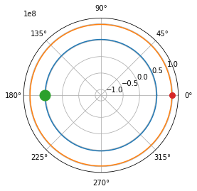

# Ukesoppgaver uke 44

Denne uka var det i oppgave å simulere en eksploderende stjærne i et binært system.

Systemet ble satt opp som,



etter en tid *t*, eksploderte den største stjerna.


### Løsningsforslaget

Løsningsforslaget bruker en egen funksjon dere har sett tidligere for å gjøre euler cromer på vpython-objektene.

```
def euler_cromer(dt, *objects):
    """
    Funksjon som utfører euler cromers metode på objektene som sendes inn i funksjonen

    Parametre:
        dt: float
            En skalar som definerer tidssteget som brukes i hver oppdatering.
    Argumenter:
        *objects: vpython objekt
            Et objekt fra vpython biblioteket. I dette tilfellet er det objektene som skal oppdatere sin posisjon og hastighet.
            NB: objektene må ha definert en akselerasjon på forhånd som:

            obj.a = vpython.vector --- altså et vektor objekt.

            Er du usikker på hvordan å bruke *args (argumenter) se python dokumentasjonen her: https://docs.python.org/3.4/tutorial/controlflow.html#keyword-arguments
    """
    for obj in objects:
        obj.vel = obj.vel + obj.a * dt
        obj.pos = obj.pos + obj.vel * dt
```

### Bonus og utfordring

PS: Som en bonus har jeg lagt inn fragmentene i selve eksplosjonen. Om dette virker komplisert - ikke legg deg for mye opp i det, men om du ønsker å utfordre deg selv kan du forsøke å endre på fragmentenes masse slik at for *N* fragmenter har de til sammen *m15* - *m3* = *m12* total masse etter eksplosjonen. Husk å inkludere en funksjon som regner ut gravitasjonskraften mellom hvert fragment og solene.

Når alt dette er gjort, hvordan endrer massesenterets posisjon seg i forhold til når vi ikke inkluderer fragmentene?